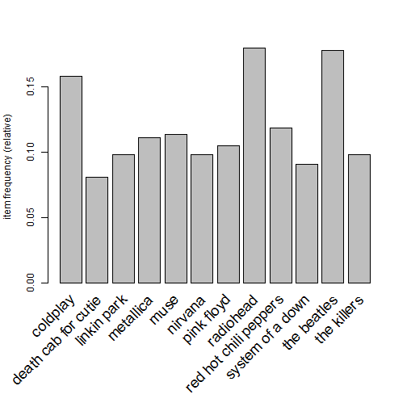

<style>
em {
  font-style: italic
}
strong {
  font-weight: bold;
}
</style>

## Introduction to Market Basket Analysis (MBA)

1. Looks at purchase coincidence
2. It investigates whether two products are being purchased together, and whether the purchase of one product increases the likelihood of purchasing the other
3. Data arranged in large matrix of rows and columns
4. Rows represent **shoppers** and columns are different **products**
5. Entries in the matrix are 1 or 0.
6. MBA used by last.fm and Netflix

--- .class #id 

## The Math behind MBA

- Look for **association rules** such as $A = LHS (\text{buy chips}) \to B = RHS (\text{buy beer})$
- LHS is **antecedent**, RHS is **consequent** and arrow is **is related to**
- "Confidence" is the condidtional probability of RHS, given LHS $$P(B|A) = \frac{P(A \text{and} B)}{P(A)}$$
- **Support** is the frquency of A or B and is calculated as $P(A)$ or $P(B)$
- *Lift of A on B* $$ lift(A \to B) = \frac{P(B|A)}{P(B)}$$
- If lift > 1, things are good
- But big lifts are relevant only if the confidence is also high
- *Leverage* of A = LHS on B = RHS as $$leverage(A \to B) = P(A \text{and} B) - P(A)P(B)$$

---
## MBA on Last.fm dataset

Suppose you were given data from a music community site. For each user you
may have a log of every artist he/she had downloaded to their computer. You
may even have demographic information on the user (such as age, sex, location,
occupation, and interests). Your objective is to build a system that recommends
new music to users in this community.

---

## Analysis in R

Let's read in the data


```r
lastfm <- read.csv("data/lastfm.csv")
head(lastfm)
```

```
##   user                  artist sex country
## 1    1   red hot chili peppers   f Germany
## 2    1 the black dahlia murder   f Germany
## 3    1               goldfrapp   f Germany
## 4    1        dropkick murphys   f Germany
## 5    1                le tigre   f Germany
## 6    1              schandmaul   f Germany
```

---
Convert "user" into a factor


```r
lastfm$user <- factor(lastfm$user)
```

Now we will use the base `split()` function to split the artists list by "user" and remove duplicate entries of artists. It is important to do so becuase later when we use the `arules` package, it is necessary to have unique values as it is not possible to coerce list with transactions with duplicated items.


```r
playlist <- split(x=lastfm[,"artist"],f=lastfm$user)
playlist[1:2]
```

```
## $`1`
##  [1] red hot chili peppers   the black dahlia murder
##  [3] goldfrapp               dropkick murphys       
##  [5] le tigre                schandmaul             
##  [7] edguy                   jack johnson           
##  [9] eluveitie               the killers            
## [11] judas priest            rob zombie             
## [13] john mayer              the who                
## [15] guano apes              the rolling stones     
## 1004 Levels: ...and you will know us by the trail of dead [unknown] ... zero 7
## 
## $`3`
##  [1] devendra banhart    boards of canada    cocorosie          
##  [4] aphex twin          animal collective   atmosphere         
##  [7] joanna newsom       air                 portishead         
## [10] massive attack      broken social scene arcade fire        
## [13] plaid               prefuse 73          m83                
## [16] the flashbulb       pavement            goldfrapp          
## [19] amon tobin          sage francis        four tet           
## [22] max richter         autechre            radiohead          
## [25] neutral milk hotel  beastie boys        aesop rock         
## [28] mf doom             the books          
## 1004 Levels: ...and you will know us by the trail of dead [unknown] ... zero 7
```

---

An artist may be mentioned by the same user more than once, hence it is important to remove artist duplicates before creating the incidence matrix.


```r
playlist <- lapply(playlist,unique) ## remove artist duplicates
```

---

We now have a list of users and the artists (unique values) they listen to. Now we will use the `arules` package for the rest of the assignmnet.


```r
library(arules)
```

```
## Warning: package 'arules' was built under R version 3.2.3
```

```r
playlist <- as(playlist,"transactions")
```
This converts the playlist to a data class defined in `arules` package as transactions. We can now set a threshold for the required support.

---


```r
itemFrequencyPlot(playlist,support=.08,cex.names=1.5)
```



---
To look at the top three most popular artists :

```r
head(sort(itemFrequency(playlist), decreasing=T),3)
```

```
##   radiohead the beatles    coldplay 
##   0.1802667   0.1778667   0.1585333
```

---
Now let us create the association rules using the `apriori` function with a support of 0.01 and confidence of 0.45.


```r
musicrules <- apriori(playlist,parameter=list(support=.01, confidence=.45))
```

```
## Apriori
## 
## Parameter specification:
##  confidence minval smax arem  aval originalSupport support minlen maxlen
##        0.45    0.1    1 none FALSE            TRUE    0.01      1     10
##  target   ext
##   rules FALSE
## 
## Algorithmic control:
##  filter tree heap memopt load sort verbose
##     0.1 TRUE TRUE  FALSE TRUE    2    TRUE
## 
## Absolute minimum support count: 150 
## 
## set item appearances ...[0 item(s)] done [0.00s].
## set transactions ...[1004 item(s), 15000 transaction(s)] done [0.04s].
## sorting and recoding items ... [655 item(s)] done [0.01s].
## creating transaction tree ... done [0.01s].
## checking subsets of size 1 2 3 4 done [0.06s].
## writing ... [120 rule(s)] done [0.00s].
## creating S4 object  ... done [0.00s].
```
---
Now on these rules, we will make a subset of only those rules which provide a lift of greater than 6.


```r
inspect(sort(subset(musicrules, subset=lift >= 6), by="confidence"))
```

```
## Error in inspect(sort(subset(musicrules, subset = lift >= 6), by = "confidence")): error in evaluating the argument 'x' in selecting a method for function 'inspect': Error in subset.default(musicrules, subset = lift >= 6) : 
##   object 'lift' not found
## Calls: sort -> subset -> subset.default
```

---
Again heartening to see that classic rock still figures in the top 3 as far as confidence is concerned. We could convert all of this to a data frame and write it as a csv file.


```r
lift6 <- sort(subset(musicrules, subset=lift >= 6), by="confidence")
```

```
## Error in subset.default(musicrules, subset = lift >= 6): object 'lift' not found
```

```r
lift6 <- as(lift6, "data.frame")
```

```
## Error in .class1(object): object 'lift6' not found
```

```r
write.csv(lift6, "lift6.csv")
```

```
## Error in is.data.frame(x): object 'lift6' not found
```

---
The top 3 rules having the highest confidence are:

```r
head(lift6, 3)
```

```
## Error in head(lift6, 3): error in evaluating the argument 'x' in selecting a method for function 'head': Error: object 'lift6' not found
```

---
We will use the `arulesViz` library for plotting all the rules with a support of 0.01 and confidence of 0.45.


```r
library(arulesViz)
```

```
## Warning: package 'arulesViz' was built under R version 3.2.3
```

```r
plot(musicrules, method="grouped", interactive=T)
```

```
## Interactive mode.
```

```
## Error in convertUnit(x, unitTo, "x", "location", "x", "location", valueOnly = valueOnly): 'x' argument must be a unit object
```


